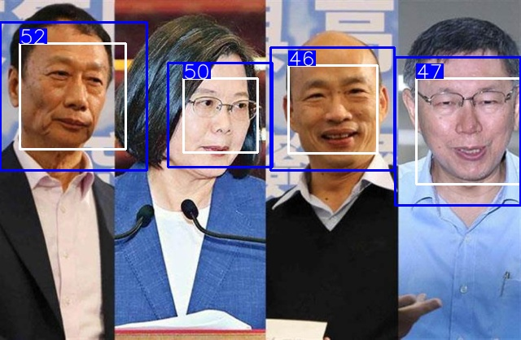
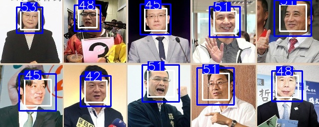
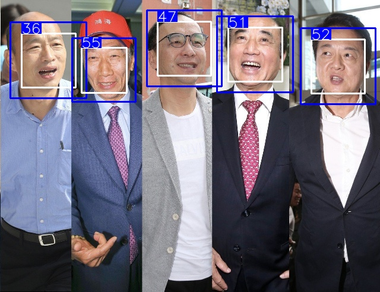

### Fork from [yu4u](https://github.com/yu4u/age-estimation-pytorch)

# Age Estimation PyTorch
PyTorch-based CNN implementation for estimating age from face images.
Currently only the APPA-REAL dataset is supported.





## Requirements

```bash
pip install -r requirements.txt
```

## Demo
change to branch [dev]
Webcam is required.

```bash
python demo.py
```

Using `-i or --img_dir` argument, images in that directory will be used as input:

```bash
python demo.py --img_dir [PATH/TO/IMAGE_DIRECTORY]
```

Further using `-o or --output_dir` argument,
resulting images will be saved in that directory (no resulting image window is displayed in this case):

```bash
python demo.py --img_dir [PATH/TO/IMAGE_DIRECTORY] --output_dir [PATH/TO/OUTPUT_DIRECTORY]
```

Using `-m or --margin` argument, Margin around detected face for age-gender estimation, default is 0.2

```bash
python demo.py -m 0.3
```

See `python demo.py -h` for detailed options.
